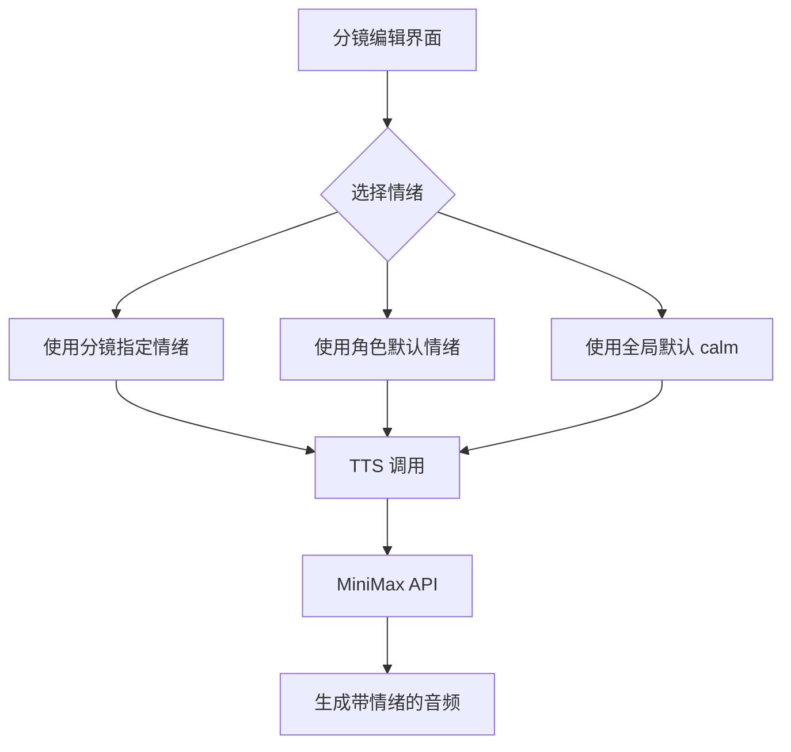

## 用户需求分析

用户希望评估 MiniMax TTS API 的 emotion（情绪）参数是否值得集成到项目的语音合成功能中。

### MiniMax TTS API emotion 参数详情

- **参数位置**：`voice_setting.emotion`
- **可选值**：`["happy", "sad", "angry", "fearful", "disgusted", "surprised", "calm", "fluent", "whisper"]`
- **对应情绪**：高兴、悲伤、愤怒、害怕、厌恶、惊讶、中性、生动、低语

### 项目当前实现

- **TTS 服务**（`server/src/ai/tts.ts`）已集成 MiniMax API，但**未使用 emotion 参数**
- **分镜数据**支持 `dubbingVoice`（音色），但**无情绪字段**
- **角色资产**支持 `voiceType`（默认音色），但**无默认情绪**

### 核心问题

1. 情绪控制是否必要？
2. 如何设计情绪参数的使用方式？
3. 需要哪些代码修改？

## 产品价值评估

### 情绪参数的实际价值

**强烈推荐集成**，理由如下：

1. **短剧配音的核心需求**：本项目是短剧制作工具，角色情绪表达是配音的灵魂

- 悲伤场景需要低沉、哀伤的语气
- 欢快场景需要活泼、明亮的语气
- 紧张场景需要急促、焦虑的语气

2. **差异化竞争优势**：情绪控制是 MiniMax 独特能力，可显著提升配音质量

3. **用户痛点解决**：当前单一情绪的配音在情感场景中会显得机械、不自然

### 建议的情绪使用策略

**分层情绪控制**（推荐）：

- **角色默认情绪**：每个角色可配置默认情绪（如"冷静型角色"默认 calm）
- **分镜情绪覆盖**：每个分镜可单独设置情绪，覆盖角色默认值
- **智能情绪推断**：未来可基于台词文本自动推断情绪（高级功能）

### 推荐支持的 6 种核心情绪

| 情绪 | 英文值 | 适用场景 |
| --- | --- | --- |
| 中性 | calm | 旁白、普通叙述 |
| 高兴 | happy | 欢快、庆祝、甜蜜 |
| 悲伤 | sad | 失落、离别、感动 |
| 愤怒 | angry | 争吵、爆发、冲突 |
| 恐惧 | fearful | 惊恐、紧张、悬疑 |
| 低语 | whisper | 秘密、内心独白、亲密 |


暂不支持：disgusted（厌恶）、surprised（惊讶）、fluent（生动）—— 使用频率较低

## 技术方案

### 实现架构



### 数据库迁移

需要新增两个字段：

```sql
-- 角色表新增默认情绪
ALTER TABLE t_assets ADD COLUMN defaultEmotion TEXT DEFAULT 'calm';

-- 分镜表新增情绪覆盖
ALTER TABLE t_storyboard ADD COLUMN dubbingEmotion TEXT;
```

### 涉及文件修改清单

#### 后端修改

1. **`server/src/db/init.ts`** - [MODIFY] 新增情绪字段迁移

- 添加 `t_assets.defaultEmotion` 字段
- 添加 `t_storyboard.dubbingEmotion` 字段

2. **`server/src/types/index.ts`** - [MODIFY] 类型定义扩展

- `Asset` 接口新增 `defaultEmotion?: string`
- `Storyboard` 接口新增 `dubbingEmotion?: string`

3. **`server/src/ai/tts.ts`** - [MODIFY] TTS 服务增加情绪参数

- `generateTTS` 函数新增 `emotion?: string` 参数
- MiniMax API 调用时传递 `emotion` 到 `voice_setting`

4. **`server/src/services/storyboardService.ts`** - [MODIFY] 分镜生成逻辑

- 分镜生成时自动匹配角色的默认情绪
- `storyboardTTSHandler` 传递情绪参数

5. **`server/src/services/assetsService.ts`** - [MODIFY] 资产服务

- 支持更新角色的 `defaultEmotion` 字段

#### 前端修改

6. **`web/src/types/index.ts`** - [MODIFY] 前端类型定义

- `Asset` 接口新增 `defaultEmotion`
- `StoryboardShot` 接口新增 `dubbingEmotion`

7. **`web/src/views/workspace/AssetsPanel.vue`** - [MODIFY] 角色资产面板

- 角色Tab新增"默认情绪"下拉选择器
- 支持 6 种核心情绪选择

8. **`web/src/views/workspace/StoryboardPanel.vue`** - [MODIFY] 分镜编辑面板

- 台词区域新增情绪选择器
- 显示当前情绪（分镜设置 > 角色默认 > 全局默认）

### 实现细节

#### TTS 服务修改核心代码

```typescript
// server/src/ai/tts.ts
export async function generateTTS(params: {
    text: string;
    voiceType: string;
    emotion?: string;  // 新增情绪参数
    configId?: number;
}): Promise<Buffer> {
    // ...
    const voiceSetting: any = {
        voice_id: params.voiceType,
        speed: 1,
        vol: 1,
        pitch: 0
    };
    
    // MiniMax 支持 emotion 参数
    if (params.emotion && config.manufacturer === 'minimax') {
        voiceSetting.emotion = params.emotion;
    }
    
    // ...
}
```

#### 情绪选择 UI 组件

```
<!-- 情绪选择器组件 -->
<el-select v-model="shot.dubbingEmotion" size="small" placeholder="自动" style="width: 100px">
    <el-option value="" label="自动（继承角色）" />
    <el-option value="calm" label="中性" />
    <el-option value="happy" label="高兴" />
    <el-option value="sad" label="悲伤" />
    <el-option value="angry" label="愤怒" />
    <el-option value="fearful" label="恐惧" />
    <el-option value="whisper" label="低语" />
</el-select>
```

### 兼容性处理

1. **现有数据兼容**：

- `dubbingEmotion` 为空时，查找角色的 `defaultEmotion`
- 角色未设置时，使用全局默认值 `calm`

2. **非 MiniMax 厂商**：

- 情绪参数仅对 MiniMax 厂商生效
- OpenAI Compatible API 忽略情绪参数（前端提示"当前模型不支持情绪控制"）

3. **API 版本**：

- 确保 MiniMax API 使用 `t2a_v2` 接口（当前已使用）